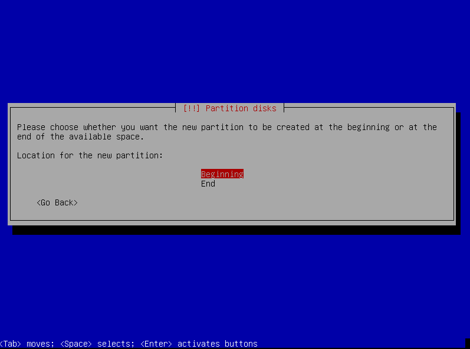
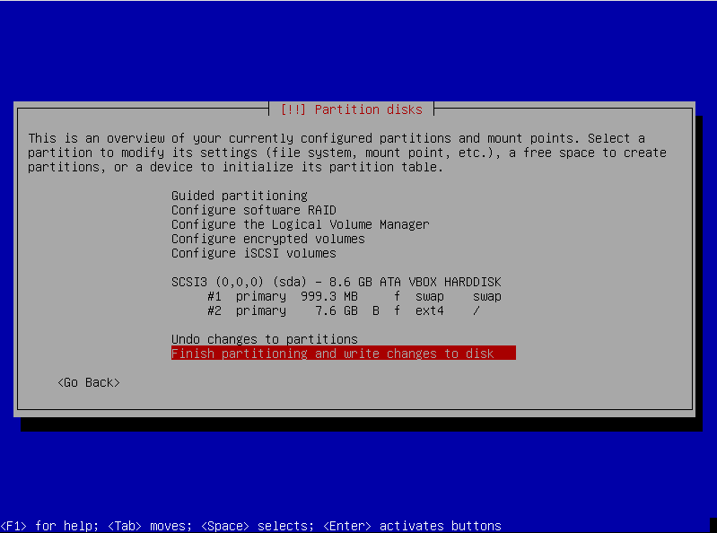

## Basic and clean installation of Debian 10

###### Download the latest version. This installation uses the debian-10.5.0-amd64-netinst version.

##### Start a VM or physical machine with the USB bootable or live CD.

*Choose the installation method that is convenient for you. In this guide we chose to install without graphics.*

 

##### Set your preferred language.

##### Set your location.

##### Set your locale.

##### Set the keyboard layout.

##### Configure the network.

##### Set root password and create your user and password.

##### Set the clock based in time zone.

##### Choose manual partitioning.

##### Choose the disk for partitioning.

##### Create a new partition table for the disk.

##### Choose the free space...

##### and create a new partition.

##### Set the size for the new partition.

##### Set type for the new partition.

##### Choose the location for the new partition.

##### After the new partition created define use as...

##### and set as swap area.

##### Finish the settings for the new partition.

##### Choose the free space on disk...

#####  and create a new partition.

##### Set the size for the new partition.

##### Set type for new partition.

##### Set bootable flag.

##### After finishing all the defined configurations, make sure that all the data are correct as shown in the image below. Done setting up the partition.

##### Finish partitioning and write to disk.

##### Wait for the base system installation to complete.

##### If you want to search for other installation CDs, you can choose them now. Since the installation we are performing is basic via netinstall image, the appropriate choice is No.

##### Set the country for the Debian installation and update mirror.

##### Set a mirror.

##### Set a http proxy, if necessary.

##### Wait for the installation and configuration of the APT.

##### Wait for the software installation.

##### Set if you want to participate in the packages usage survey.

##### Select the software installation you want. As the installation we want is basic and clean, choose only the SSH server and leave the rest unchecked.

##### Wait for the software installation.

##### Confirm the installation of GRUB in the master boot record.

##### Set a disk for the GRUB boot loader.

##### Wait for GRUB install.

##### Finish the installation.

##### It's done!

##### **Have fun.**

